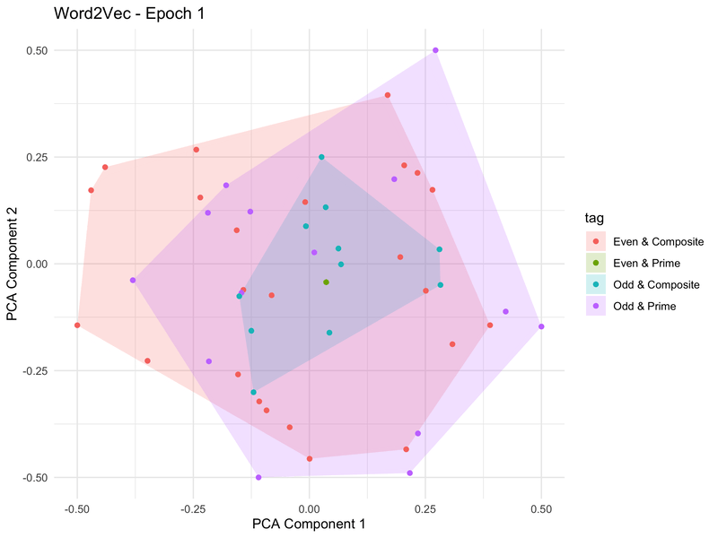

# 🧠 The Lonely Prime: Tokenization, Embeddings & Visualization

This project explores how simple numeric facts (e.g., "2 is a prime number") can be used to train language models like Word2Vec and visualize how meaningful semantic structures emerge from training.

We demonstrate this pipeline by:
- Generating labeled sentences about numbers 1 to 50
- Tokenizing and preparing text for embedding
- Training a Word2Vec model
- Visualizing learned embeddings with PCA
- Tracking embedding evolution over epochs
- Visualizing results in R with cluster overlays

---

## 📁 Project Structure

```
data/
├── numbers.txt                       # Training data

notebooks/
├── training_and_visualization.ipynb  # Main Jupyter notebook (Python)

src/
├── visualize_embeddings.Rmd          # R Markdown for embedding visualization
├── utils.py                          # Helper functions to generate training set

outputs/
├── models/                           # word2vec models
├── pca_vector_vis/                   # Visualized PNGs from each epoch
├── pca_vectors/                      # PCA vectors from each epoch
├── video/                            # Visualized gif from all epochs

```

---

## 🔧 Key Technologies

- **Python**: Sentence generation, tokenization, Word2Vec training (`gensim`), PCA
- **SentencePiece**: BPE tokenizer training
- **R / ggplot2**: PCA visualization with semantic clustering
- **NumPy / Pandas / Matplotlib / Scikit-learn**: Core analytics and plotting tools

---

## 🧪 How It Works

1. **Sentence Generation**  
   Basic math facts (prime/composite, even/odd) are used to generate natural language statements for numbers 1–50.

2. **Tokenization**  
   Sentences are cleaned, tokenized, and optionally processed via a BPE tokenizer using `sentencepiece`.

3. **Word2Vec Training**  
   A Word2Vec model is trained to capture contextual similarity among words (and numbers).

4. **Embedding Evolution**  
   Models are retrained over increasing epochs. Word vectors are reduced via PCA and exported as CSV files.

5. **Visualization in R**  
   The R Markdown script `src/visualize_embeddings.Rmd` loads all CSVs and generates color-coded cluster plots for semantic categories:
   - Prime vs. Composite  
   - Even vs. Odd  
   - Overlays with convex hulls

---

## 📊 Example Visualization



---

## ▶️ Reproduce the Project

1. Clone this repo  
   ```bash
   git clone git@github.com:nabizadeh/the-lonely-prime.git
   cd the-lonely-prime
   ```

2. Run the Jupyter notebook:  
   `notebooks/training_and_visualization.ipynb`

3. Render the R Markdown visualization:  
   Open `src/visualize_embeddings.Rmd` in RStudio and knit to HTML

---

## 📎 Related Topics

- NLP tokenization
- Word embeddings & Word2Vec
- PCA for high-dimensional vectors
- Visualizing semantic structure in language models

---

## 📬 Contact

Feel free to connect on [LinkedIn](https://www.linkedin.com/in/mo-nabi) or open an issue for questions or suggestions.
